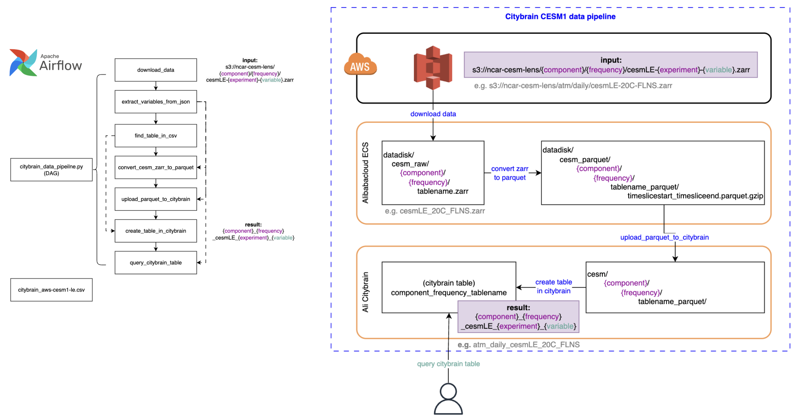

# CityBrainClimateData

**Introduction**

This project develops data pipelines to streamline the process of extracting CESM data from AWS S3, transforming and loading data into in Citybrain.

The data pipeline includes the following steps:
1. Download data from AWS: Use a bash script to download data from the specified S3 URI.
2. Save parameters in JSON: Save relevant parameters in a JSON file.
3. Data transformation: Convert the downloaded data from Zarr to Parquet and perform data transformations.
4. Create table in Citybrian: Create a table in Citybrian using the Parquet files and the parameters in the JSON file.
5. Quality Assurance (QA): Download sample data from Citybrian to check if the data pipeline has functioned correctly and assess data quality.   

For example, CESM1 data pipeline:

**How to run the data pipeline**

In this project, Apache Airflow DAG is used to orchestrate the workflow. Replace the default S3 URI with the S3 URI of the target data and trigger the DAG execution, then monitor the progress and status of each task. 

Before running a data pipeline: 
- Citybrain platform access: Sign up for a Citybrain platform account 
- Set up the environment and install required libraries
- Donwload **aws-cesm1-le.csv** and **aws-cesm2-le.csv**
    - aws-cesm1-le.csv can be downloaded from https://ncar.github.io/cesm-lens-aws/ (Data Catalog)
    - aws-cesm2-le.csv can be downloaded from https://ncar-cesm2-lens.s3-us-west-2.amazonaws.com/catalogs/aws-cesm2-le.csv

